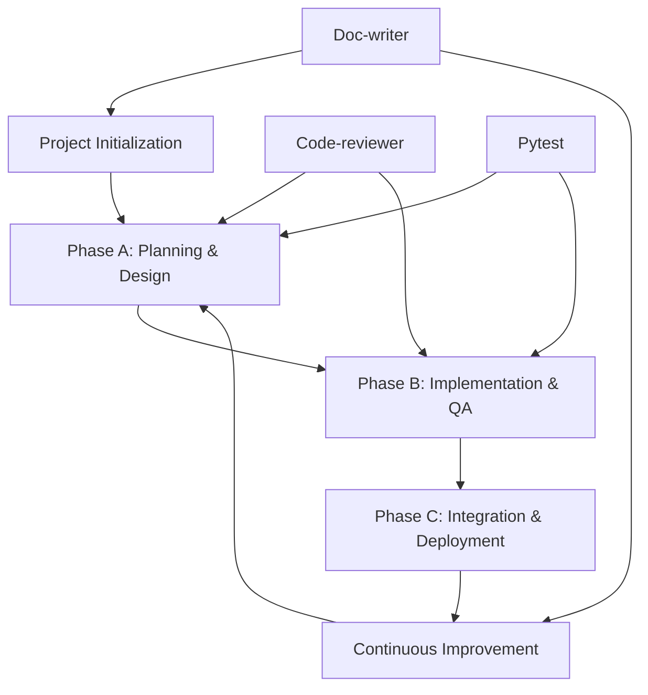

# Claude Code 汎用開発プロセスフロー

## 概要

本ドキュメントは、Claude Codeを使用した高品質なソフトウェア開発のための汎用プロセスフローを定義します。特許仕分けプロジェクトでの実践を通じて検証された、TDD（テスト駆動開発）とCode-reviewerエージェントを活用したPDCAサイクルベースの開発手法です。

## 前提条件

### 必要なツール・エージェント
- **code-reviewer**: コード品質・セキュリティ・パフォーマンス分析
- **doc-writer**: 技術ドキュメント作成
- **general-purpose**: 複雑な検索・調査タスク
- **pytest**: 自動テスト実行
- **Git**: バージョン管理

### 環境要件
- Python仮想環境（推奨: `C:\venvs\env-llm`）
- 共通ジャンクション設定（`.venv` → `C:\venvs\env-llm`）
- 適切なIDE設定（VS Code推奨）

## プロセス全体概要



## Phase 0: プロジェクト初期化

### 0.1 環境セットアップ
```bash
# 仮想環境作成・ジャンクション設定
New-Item -ItemType Junction -Path '.venv' -Target 'C:\venvs\env-llm'

# 依存関係インストール
.venv\Scripts\python.exe -m pip install -r requirements.txt

# 環境変数設定
cp .env.example .env
# Edit .env with necessary API keys
```

### 0.2 基盤ドキュメント作成
1. **要件定義書作成**
   - プロジェクト概要、技術要件、受け入れ基準
   - 開発プラン記載欄を準備

2. **CLAUDE.md作成**
   - Claude Code用のプロジェクトガイダンス
   - 開発コマンド、設定情報、重要な注意事項

3. **基本構成ファイル**
   - `config.yaml`: アプリケーション設定
   - `requirements.txt`: 依存関係定義
   - ディレクトリ構造作成

### 0.3 初期文書化
```bash
# Doc-writerエージェントを使用
claude-code task --agent doc-writer "Create comprehensive README.md based on project structure and requirements"
```

## Phase A: Planning & Review-Driven Design

### A.1 要件分析・設計レビュー
1. **機能要件の明確化**
   - 実装対象機能の詳細仕様確認
   - 入出力仕様、エラーハンドリング要件の定義

2. **テストケース設計**
   - 正常系・異常系・境界値テストケースの設計
   - セキュリティ・パフォーマンステストケースの設計

### A.2 Code-reviewer設計レビュー
```bash
# テストケースの設計品質をレビュー
claude-code task --agent code-reviewer \
  "Review test cases in tests/unit/test_[module].py for:
  1. Design quality and completeness
  2. Implementation guidance
  3. Security considerations  
  4. Performance recommendations
  5. Integration points"
```

**期待される成果物:**
- 実装時の注意点・設計指針
- セキュリティ脆弱性の事前特定
- パフォーマンス最適化ポイント
- 他モジュールとの統合方針

### A.3 テストケース改善・実装
```bash
# 設計レビューの指摘事項を反映
# セキュリティテストケース追加
# パフォーマンステストケース追加
# エッジケースの網羅性向上

# 初回pytest実行（Red確認）
.venv\Scripts\python.exe -m pytest tests/unit/test_[module].py -v
```

## Phase B: Implementation & Quality Assurance

### B.1 実装フェーズ
1. **Phase A指針に基づく実装**
   - 設計レビューで特定されたセキュリティ要件の実装
   - パフォーマンス最適化の組み込み
   - エラーハンドリングの充実

2. **機能実装**
   ```bash
   # 実装完了後、機能確認
   .venv\Scripts\python.exe -m pytest tests/unit/test_[module].py -v
   ```

### B.2 Code-reviewer実装レビュー
```bash
# 実装コードの品質レビュー
claude-code task --agent code-reviewer \
  "Review src/[module].py for:
  1. Security vulnerabilities
  2. Performance optimizations
  3. Code quality and readability
  4. Error handling improvements
  5. Best practices compliance"
```

**レビュー観点:**
- **セキュリティ**: 入力検証、DoS攻撃対策、パストラバーサル防止
- **パフォーマンス**: メモリ効率、処理速度、リソース使用量
- **保守性**: コード構造、エラーハンドリング、ドキュメント
- **品質**: 型ヒント、命名規則、設計パターン

### B.3 リファクタリング
```bash
# レビュー指摘事項の修正実施
# Critical/High優先度から順次対応
# セキュリティ脆弱性の即座修正
# パフォーマンスボトルネックの解消

# 最終テスト実行
.venv\Scripts\python.exe -m pytest tests/unit/test_[module].py -v
```

### B.4 統合テスト
```bash
# 既存モジュールとの結合確認
.venv\Scripts\python.exe -m pytest tests/ -v

# カバレッジ確認
.venv\Scripts\python.exe -m pytest --cov=src tests/
```

## Phase C: Integration & Deployment

### C.1 システム統合テスト
```bash
# E2Eテストの実行
.venv\Scripts\python.exe -m pytest tests/integration/ -v

# 実データでの動作確認
python src/main.py --test-mode
```

### C.2 ドキュメント更新
```bash
# 実装完了後のドキュメント更新
claude-code task --agent doc-writer \
  "Update documentation based on completed implementation:
  1. API specifications
  2. Usage examples
  3. Configuration guide
  4. Troubleshooting"
```

### C.3 品質メトリクス確認
- テストカバレッジ: 90%以上
- セキュリティスキャン: クリティカル脆弱性ゼロ
- パフォーマンステスト: 要件範囲内
- コード品質: Linter/Formatter通過

### C.4 バージョン管理・デプロイ
```bash
# 開発完了をコミット
git add .
git commit -m "feat: implement [module] with security and performance optimizations

🤖 Generated with [Claude Code](https://claude.ai/code)

Co-Authored-By: Claude <noreply@anthropic.com>"

# リモートリポジトリへプッシュ（要確認）
git push origin main
```

## 継続的改善サイクル

### プロジェクト管理
1. **要件定義書の継続更新**
   - 開発プランの進捗反映
   - 新たな要件・制約の追記
   - 実装完了項目のステータス更新

2. **CLAUDE.mdのメンテナンス**
   - 新しい開発パターンの追記
   - 設定情報の更新
   - トラブルシューティング情報の蓄積

### 品質向上活動
1. **定期的な全体レビュー**
   ```bash
   # プロジェクト全体の品質確認
   claude-code task --agent code-reviewer \
     "Perform comprehensive project review for architecture, security, and performance"
   ```

2. **テストケースの継続改善**
   - 新たなエッジケースの発見・追加
   - セキュリティテストの強化
   - パフォーマンスベンチマークの追加

## エージェント活用のベストプラクティス

### Code-reviewer エージェント
**使用タイミング:**
- Phase A: 設計・テストケースレビュー
- Phase B: 実装コードレビュー
- 定期的: プロジェクト全体レビュー

**効果的な活用法:**
- 具体的なレビュー観点を指定
- セキュリティ・パフォーマンス・保守性の3軸で評価
- Critical/High/Medium/Lowの優先度付きフィードバック取得

### Doc-writer エージェント  
**使用タイミング:**
- プロジェクト開始時: README、API仕様作成
- 実装完了時: ドキュメント更新
- リリース前: Change log作成

### General-purpose エージェント
**使用タイミング:**
- 複雑な調査・検索タスク
- 複数ファイルにまたがる修正
- 設定ファイルの一括更新

## プロジェクト成功指標

### 品質指標
- **テストカバレッジ**: 90%以上
- **セキュリティ**: 脆弱性ゼロ
- **パフォーマンス**: 要件充足
- **保守性**: Code-reviewerスコア80点以上

### プロセス指標  
- **開発効率**: Phase A,B完了時間の短縮
- **品質向上**: Code-reviewerの指摘事項減少
- **ドキュメント整備**: 技術文書の網羅性・正確性

### 成果物品質
- **コード**: セキュア・高性能・保守性の高い実装
- **テスト**: 包括的・堅牢なテストスイート  
- **ドキュメント**: 正確・最新・使いやすい技術文書

## 注意事項・制約

### セキュリティ
- 機密情報のコミット禁止
- API キーの適切な管理
- 入力検証の徹底

### バージョン管理
- リモートリポジトリアドレスの都度確認
- コミットメッセージの規約遵守
- ブランチ戦略の明確化

### 品質管理
- Code-reviewerの指摘事項への確実な対応
- テストの継続実行
- ドキュメントの同期保持

---

このプロセスフローは、Claude Codeエージェントの特性を活かした高品質・高効率な開発手法です。プロジェクトの性質に応じてカスタマイズして活用してください。